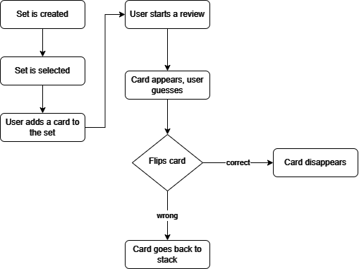

<p align="center">
    
</p>

FlashLearn is a simple and user-friendly flashcards application built with Python and Tkinter. This app allows users to create, organize, and review flashcards to enhance learning and retention. Simple, yet flexible tool for students and educators.

## Features  

- **Set Creation**: Easily create and manage sets of flashcards.  
- **Card Creation**: Add individual cards with questions and answers to your sets.  
- **Review Mode**: Test your knowledge by reviewing and flipping through flashcards.   

## Requirements  

- Python 3.10+  
- ttkbootstrap 1.10.1+


## Installation  

1. Clone this repository:  
   ```bash
   git clone https://github.com/jkalend/Seoultech_flashcards
   cd Seoultech_flashcards
   ```

2. Install requirements:
   ```bash
   pip install -r requirements.txt
   ```

## Usage

Run the application:
   ```bash
   python main.py
   ```
## Demo video

For a detailed demonstration of FlashLearn application [follow the link here](https://www.youtube.com/shorts/tWCc1jfP5NU).

## File Structure

- `card_handler.py`: Manages saving flashcard sets and cards with user feedback in a GUI.
- `data_handler.py`: Handles loading and saving application data using a pickle file.
- `gui.py`: Creates a graphical user interface for managing flashcard sets, adding cards, and reviewing them with interactive features like set selection, card flipping, and tracking progress.
- `LICENSE`: License file for the project. 
- `main.py`: Main application file.
- `review_logic.py`: Implements the logic for reviewing flashcards, including flipping cards, marking responses as correct or wrong, tracking progress, and managing UI updates during the review process.
- `README.md`: Documentation for the project.
- `requirements.txt` : Lists Python dependencies.

## Program algorithm

<p align="center">
    
</p>

## License

This project is licensed under the MIT License.